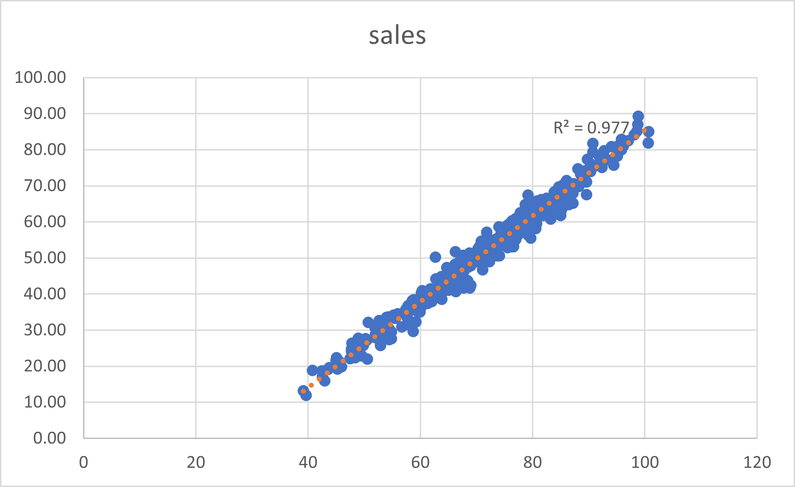

# 🍦 Ice Cream Sales Analysis

## Executive Summary

Analyzed 2019 ice cream sales data to identify factors driving revenue and provide actionable recommendations for inventory management, staffing, and marketing strategy. Key finding: **temperature is the dominant sales driver**, with hot days generating 148% more revenue than cold days.

---

## 📋 Table of Contents

- [Business Context](#business-context)
- [Business Questions](#business-questions)
- [Dataset Overview](#dataset-overview)
- [Methodology](#methodology)
- [Key Findings](#key-findings)
- [Recommendations](#recommendations)
- [Limitations & Next Steps](#limitations--next-steps)
- [Technical Skills Demonstrated](#technical-skills-demonstrated)
- [Repository Structure](#repository-structure)

---

## Business Context

**Scenario:** As a data analyst working for an ice cream company, management wants to improve sales performance. The company has been collecting data about its sales—but not a lot. The available data is from an internal data source and is based on sales for 2019.

**The Ask:** Review the data and provide insight into the company's ice cream sales to help management make data-driven decisions about inventory, staffing, and marketing.

Data-driven answers to these questions can reduce waste, prevent stockouts, and maximize revenue.

---

## Business Questions

| # | Question | Status |
|---|----------|--------|
| 1 | What is the most popular ice cream flavor? | ✅ Answered |
| 2 | How does temperature affect sales? | ✅ Answered |
| 3 | How do weekends and holidays affect sales? | ✅ Answered |
| 4 | How does profitability differ for new vs returning customers? | ⚠️ Data not available |

---

## Dataset Overview

| Sheet | Rows | Columns | Description |
|-------|------|---------|-------------|
| flavors | 208 | 3 | Weekly unit sales by flavor (52 weeks × 4 flavors) |
| temperatures | 366 | 2 | Daily temperature and sales |
| sales | 366 | 2 | Daily date and sales |

**Time Period:** January 1, 2019 – December 31, 2019

**Flavors Tracked:** Chocolate, Lemon, Strawberry, Vanilla

---

## Methodology

### Question 1: Most Popular Flavor
- **Metric Definition:** "Popular" defined as total units sold (revenue data unavailable)
- **Technique:** Aggregated weekly sales by flavor using `SUMIFS`

### Question 2: Temperature Impact
- **Approach:** Correlation analysis + practical grouping
- **Techniques:** 
  - Scatter plot with linear trendline
  - R² calculation for correlation strength
  - `AVERAGEIFS` to calculate average sales by temperature range

### Question 3: Weekend/Holiday Impact
- **Approach:** Created derived "Day Type" column, then compared averages
- **Techniques:**
  - `WEEKDAY()` function to identify Saturdays/Sundays
  - `COUNTIF` to match dates against holiday list
  - Nested `IF` statements for classification
  - `AVERAGEIF` for group comparisons

### Question 4: Customer Segmentation
- **Approach:** Gap analysis — identified missing data requirements

---

## Key Findings

### 1. 🏆 Most Popular Flavor: Lemon

| Flavor | Units Sold | Market Share |
|--------|------------|--------------|
| **Lemon** | **713** | **34%** |
| Vanilla | 527 | 25% |
| Chocolate | 460 | 22% |
| Strawberry | 399 | 19% |

**Insight:** Lemon outsells the next closest flavor (Vanilla) by 35%.

---

### 2. 🌡️ Temperature Strongly Drives Sales

| Temperature Range | Avg. Daily Sales | vs. Cold Days |
|-------------------|------------------|---------------|
| Below 60°F | $28.10 | — |
| 60°F – 80°F | $50.70 | +80% |
| Above 80°F | $69.80 | **+148%** |

**Statistical Strength:** R² = 0.977 (temperature explains 98% of sales variation)



**Insight:** This is the most actionable finding — temperature is a near-perfect predictor of daily sales.

---

### 3. 📅 Weekends & Holidays: Minimal Impact

| Day Type | Avg. Sales | vs. Weekday |
|----------|------------|-------------|
| Weekday | $104.47 | — |
| Weekend | $104.96 | +0.5% |
| Holiday | $99.33 | -5% |

**Insight:** Contrary to expectations, weekends don't boost sales, and holidays actually show *lower* sales (possibly due to reduced hours or customers traveling).

---

### 4. ❓ Customer Segmentation: Data Gap

Current dataset lacks customer identifiers. Cannot analyze new vs returning customer profitability without:
- Customer IDs
- Purchase history
- Customer acquisition date

---

## Recommendations

### Inventory Management

| Recommendation | Rationale | Expected Impact |
|----------------|-----------|-----------------|
| **Stock 2.5x more inventory on days forecast above 80°F** | Sales are 148% higher on hot days | Prevent stockouts, capture full demand |
| **Prioritize Lemon flavor inventory** | 34% market share, outsells #2 by 35% | Reduce stockouts of top seller |
| **Maintain regular inventory on weekends/holidays** | No significant sales lift | Avoid overstocking and waste |

### Staffing

| Recommendation | Rationale |
|----------------|-----------|
| **Monitor 5-day weather forecast for scheduling** | Temperature is near-perfect sales predictor |
| **Schedule additional staff when temps > 80°F expected** | Higher volume requires faster service |
| **No extra staffing needed for weekends/holidays** | Sales volume unchanged |

### Marketing & Strategy

| Recommendation | Rationale |
|----------------|-----------|
| **Promote Lemon as signature flavor** | Already top seller — lean into strength |
| **Consider heat-triggered promotions** | Target high-intent customers on hot days |
| **Investigate holiday underperformance** | Opportunity to capture missed revenue |

### Data Collection

| Recommendation | Rationale |
|----------------|-----------|
| **Implement customer tracking** | Enable new vs returning customer analysis |
| **Collect revenue data by flavor** | Allow profitability analysis beyond units |
| **Record hourly sales** | Enable time-of-day optimization |

---

## Limitations & Next Steps

### Limitations

1. **No revenue/profit data by flavor** — Analysis limited to unit sales
2. **No customer data** — Cannot segment by customer type
3. **Single year of data** — Cannot identify year-over-year trends
4. **Unknown data collection method** — Temperature/sales alignment assumed but unconfirmed

### Recommended Next Steps

1. Obtain customer purchase data to complete Question 4
2. Acquire multi-year data to identify seasonality patterns
3. Collect flavor-level revenue data for profitability analysis
4. Validate temperature data represents local conditions

---

## Technical Skills Demonstrated

| Category | Skills |
|----------|--------|
| **Data Analysis** | Exploratory data analysis, correlation analysis, segmentation |
| **Excel Functions** | SUMIFS, AVERAGEIFS, AVERAGEIF, COUNTIF, WEEKDAY, nested IF statements |
| **Data Visualization** | Scatter plots, trendlines, R² interpretation |
| **Data Transformation** | Creating derived columns, date classification |
| **Business Acumen** | Translating analysis into actionable recommendations |
| **Communication** | Structuring findings for stakeholder consumption |

---

## Repository Structure

```
ice-cream-sales-analysis/
│
├── README.md                 # Project overview and findings
├── data/
│   └── ice_cream_sales.xlsx  # Raw data with analysis sheets
├── images/
│   ├── temperature_scatter_plot.png
│   ├── flavor_sales_chart.png
│   └── day_type_comparison.png
└── docs/
    └── analysis_summary.pdf  # One-page executive summary (optional)
```

---

## About This Project

**Course:** Google Data Analytics Professional Certificate

**Scenario:** Data analyst at an ice cream company tasked with analyzing 2019 sales data to help management improve sales performance.

**Goal:** Practice the full analytical workflow — asking the right questions, preparing data, analyzing patterns, and communicating actionable insights to stakeholders.

---

## Author

[MD Noornabi]

[LinkedIn](https://www.linkedin.com/in/md-noornabi25/) | [Portfolio](https://github.com/cracker-MDN)

---

## License

This project is for educational purposes as part of the Google Data Analytics Certificate program.

